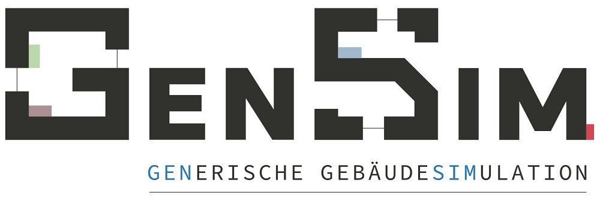

# GenSim

Generische Gebäudesimulation auf Basis von EnergyPlus™.

GenSim erzeugt anhand einfacher Eingabeparameter ein vollständiges EnergyPlus™-Gebäudemodell, simuliert dieses und gibt anschließend Ergebnisse in Form von Lastprofilen und Jahreswerten zurück.

<<<<<<< HEAD
**Die Benutzeroberfläche (GUI) für GenSim ist derzeit noch nicht im Repository enthalten. Diese wird derzeit noch für die Veröffentlichung vorbereitet und integriert sobald dies abgeschlossen ist.**

=======
>>>>>>> 2376f6f... Initial commit as import of existing source code and config files.
# Benutzung
Eine detailierte Dokumentation der Benutzung von GenSim wird auf der [offiziellen Dokumentation](https://quasi-software.readthedocs.io/en/latest/) des übergeordneten Projekts QuaSi zur Verfügung gestellt werden. Im Folgenden gibt es eine schnelle Einführung in die Benutzung.

TBD

# Lizenz
GenSim ist unter der MIT Lizenz veröffentlicht. Der Lizenztext ist in Datei `LICENSE.md` zu finden. Die gelisteten Personen sind als Autor\*innen von GenSim im Sinne des Urheberrechts zu verstehen. Wo nicht anders angegeben sind alle mitgelieferten Quell- und Binärdateien als von den Autor\*innen verfasst und unter der MIT Lizenz veröffentlich zu verstehen. Davon unberührt bleiben eingebundene Drittpartei-Quellen, welche mit deren entsprechender Lizenz versehen sind.

# Herausgeber und Förderung
GenSim wurde im Rahmen des Forschungsprojektes **ES-West_P2G2P: Klimaneutrales Stadtquartier Neue Weststadt Esslingen** entwickelt und wird im Rahmen des Forschungsprojektes **QuaSi_II: Simulationssoftware zur Planung Bewertung nachhaltiger Energieversorgung von Stadtquartieren** weiterentwickelt und herausgegeben.

Hauptentwickler und Herausgeber sind:
* Maile Consulting
* siz energieplus

Nach einer Idee von Thilo Sautter von EGS-plan.

